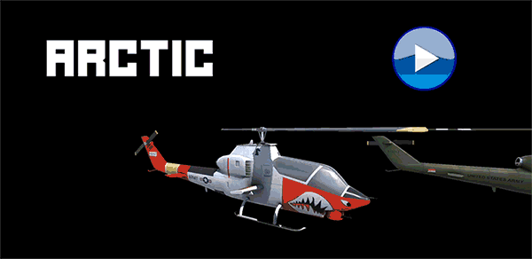

# Blitzkrieg

## A simple Helicopter Simulation made using Unity `WITHOUT` any `AR` SDK.

### Game uses Camera's Texture and Phone's Gyro to `View` and `Rotate`
### Using Unity's Physics Engine and Cross-Platform Inputs to `Handle`
### Game uses `3D Stereo` Sounds, headphones recommended.

## Screenshots

